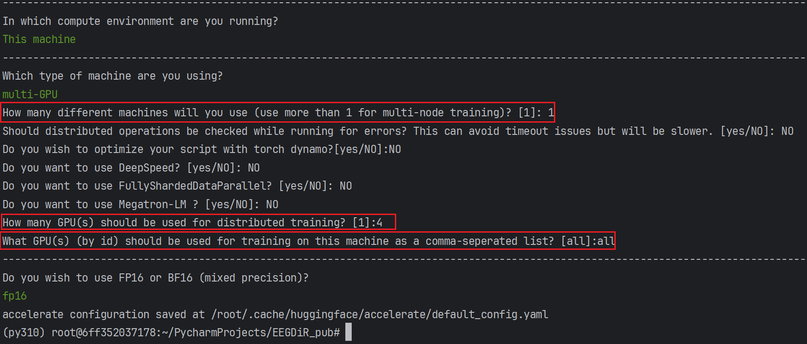

## EEGDiR: Electroencephalogram denoising network for temporalinformation storage and global modeling through Retentive Network


<b>
Bin Wang, 
<a href='https://dengfei-ailab.github.io'>Deng Fei</a>, 
<a href='https://github.com/jiangpeifan'>Peifan Jiang</a>
</b>
<b>

<hr>
<i>Electroencephalogram (EEG) signals are essential in clinical medicine, brain research, and neurological disease studies. However, various physiological and environmental artifacts introduce noise, 
hindering accurate analysis of brain activity. Recent advancements in deep learning offer promising solutions for enhancing EEG signal denoising compared to traditional methods. In this study, 
we introduce the Retentive Network architecture from large language model (LLM) to EEG signal denoising, leveraging its robust feature extraction and global modeling capabilities. 
To adapt Retnet to the one-dimensional nature of EEG signals, we propose a signal embedding method, 
transforming EEG signals into two dimensions for network input. This integration presents a novel approach 
to EEG denoising, opening avenues for a profound understanding of brain activities and accurate diagnosis 
of neurological diseases. In addition, since the creation of deep learning datasets is very time-consuming 
and cumbersome, we also provide a standardized ready-to-use dataset that has been preprocessed to accelerate 
the progress of deep learning methods. Based on the dataset we produced and the proposed method, t
he experimental results show that the denoising effect is significantly improved compared to the existing methods.</i>

--- 
</b>
</br>

Congratulations! This paper was accepted by <a href='https://www.sciencedirect.com/journal/computers-in-biology-and-medicine/vol/177/suppl/C'>Elsevier CIBM</a>.
</br>
<a href='https://www.sciencedirect.com/science/article/abs/pii/S001048252400711X'>https://www.sciencedirect.com/science/article/abs/pii/S001048252400711X</a>
</b>

---

## How to get dataset:
dataset is available at: https://huggingface.co/datasets/woldier/eeg_denoise_dataset

The method chosen in this article is to download and extract `*.tar.gz` to the `{your_path}/data` directory.

Alternatively, the dataset can be prepared with `data/data_processing_4_EEGDenoiseNet.py` and `data_processing_4_SS2016.py`.

The structure is as follows:
```text
data/
├── dataset/
    ├── EMG
    │   ├── train
    │   ├── test
    ├── EOG
    │   ├── train
    │   ├── test
    ├── SS-EOG
    │   ├── train
    │   ├── test
├── source/
    ├── EEG_all_epochs.npy  (EEGDenoiseNet)
    ├── EMG_all_epochs.npy  (EEGDenoiseNet)
    ├── EOG_all_epochs.npy  (EEGDenoiseNet)
    ├── Contaminated_Data.mat  (SS2016)
    └── Pure_Data.mat  (SS2016)
├── data_processing_4_EEGDenoiseNet.py
└──  data_processing_4_SS2016.py
```

---

## Package dependencies
The project is built with `PyTorch 1.13.1`, `Python3.10`, `CUDA11.7`. For package dependencies, you can install them by:
```bash
pip install -r requirements.txt
```
---
## How to configure training cards
We use `yaml` format configuration files, and import the configuration files via `pyyaml`.

The configuration files are stored in the `{your_path}/config/` directory.

You need to set the path to config in `train.py`.

The configuration of `config.yml` is divided into four main sections, Model Configuration, Training Parameters Configuration, Dataset Configuration, Logging Configuration.


```yaml
#==========================model config================================
model:
  # The model initialization parameters are configured 
  # and passed to the model initialization function as **kwargs.
  config:  
    layers: 1key
    hidden_dim: 512
    ffn_size: 1024
    heads: 8
    double_v_dim: False
    seq_len: 512
    mini_seq: 32
    drop_out: 0.1
  # Configure the path to the model's package file 
  #Similar to `from model.retnet.retnet import DiR`
  path: model.retnet.retnet 
  class_name: DiR
  # Weight file path, if there is a weight file it will be loaded.
  weight_path:   

#==========================training config================================
train:
  epochs: 5000 
  batch_size: 1000  # Number of samples in a batch
  save_img_rate: 1 # How many rounds to save a step
  learning_rate: 0.0005
#==========================dataset config================================
dataset:
  train:
    dataset_path: ./data/dataset/EMG/train  # the path to load train data
  test:
    dataset_path: ./data/dataset/EMG/test # the path to load test data
#==========================logs=======================================
logs:
  name: DiR_4_EOG_pathch16_mini_seq32_hidden_dim512_layer_1_EMG
```

For the log file, it will be saved in the same directory as `train.py` by default. 
In addition, an extra configuration file is saved. This is used to save the training details.

The structure of the log folder is as follows:
```text
results/DiR_4_EOG_pathch16_mini_seq32_hidden_dim512_layer_1_EMG/
├── img
    ├── train
    ├── test
├── logs
    ├── log.txt
├── weight
    ├── best.pth
    ├── Epoch0.pth
└── config.yml
```

---
## How to run
1. Single GPU pycharm run
The easiest way is to run `trian.py` directly under pycham

This library uses the Accelerate library, so you don't need to make any modifications to this training framework. Accelerate will automatically convert your data to the GPU (if supported).
2. Multi-GPU run in CMD

If you want to train on multiple GPUs, you can refer to the following code

Before running it for the first time, you need to generate a configuration file through accelerate, telling accelerate which GPUs are currently involved in the training.
```shell
accelerate config
```


Once you have configured the accelerate config file, you can view the configuration via `accelerate env`(Optional).

Multi-GPU training can then be performed by calling `train.py`.
```shell
accelerate launch --gpu_ids=all  {your_path}/train.py
```
For more details, please refer to the Accelerate website: 
https://huggingface.co/docs/accelerate/basic_tutorials/launch
3. Multi-GPU run in pycharm 

If you find the cmd call scripts inelegant, you can also configure pycharm.

- Create a New Run/Debug Configuration
- Setting the ENV of RUN
- Set the mode to module, and give the model name: `accelerate.commands.launch`.
- Set the parameter `--gpu_ids=all` to set the available GPUs, and specify the script path `{your_path}/trian.py`.
- Note that it is recommended to inform Accelerate of the current device hardware via `accelerate config` before running.


enjoy!

---
This training framework is not perfect, 
I will continue to update it. 

If you have any ideas on how to improve this framework please issue or PR.
